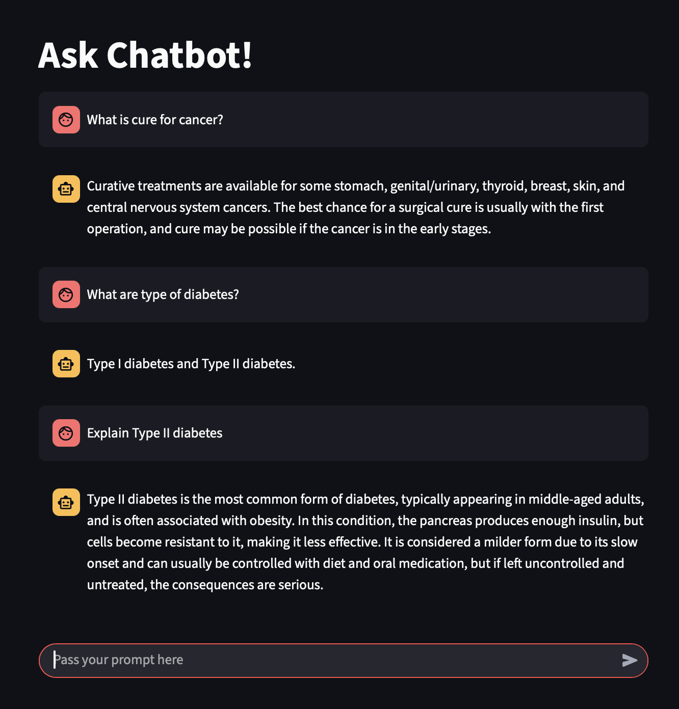
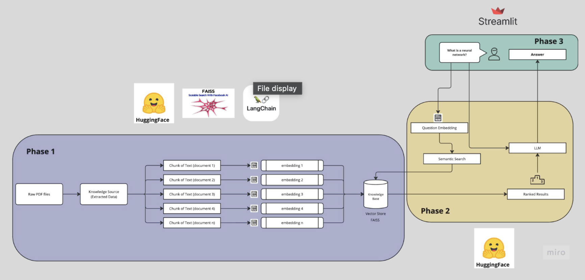

# 🩺 MediBot — A Medical Chatbot Powered by LLMs

**MediBot** is an AI-powered medical assistant chatbot designed to answer questions based on trusted medical literature — the same books doctors study and refer to. This project was inspired by my internship at **Hackensack Meridian Health**, where we worked on a clinical summarization chatbot using large language models.

> ⚠️ This is a **research and educational prototype** and **not intended for clinical or diagnostic use.**

---

## 💡 Key Features

- 📚 **Medical Knowledge Base**  
  Load and index standard medical textbooks and PDFs into a vector store using embeddings.

- 🔎 **Context-Aware Question Answering**  
  Uses retrieval-augmented generation (RAG) to answer questions using relevant medical context.

- 🤖 **LLM-Powered Chat Interface**  
  Built using cutting-edge models from HuggingFace and accelerated with Groq for faster inference.

- 🌐 **Interactive Frontend**  
  User-friendly web interface built with Streamlit for smooth interaction.

---

## 🛠 Tech Stack

| Tool          | Purpose |
|---------------|---------|
| 🔗 [LangChain](https://www.langchain.com/) | Building the RAG pipeline |
| 🤗 [HuggingFace Transformers](https://huggingface.co/) | Access to open-source LLMs |
| ⚡ [Groq](https://groq.com/) | Fast inference for LLM responses |
| 🧠 [FAISS](https://github.com/facebookresearch/faiss) | Vector similarity search |
| 📊 [Streamlit](https://streamlit.io/) | Web frontend |
| 🐍 Python | Core logic and orchestration |

---

## 📸 Screenshots

Here’s a quick look at the MediBot interface:  

---

## 🧭 System Architecture

The high-level architecture of MediBot looks like this:  

## 🚀 How It Works

1. **Load PDFs** — Chunk medical PDFs and convert them into text.  
2. **Create Embeddings** — Use HuggingFace models to generate vector embeddings.  
3. **Store in Vector DB** — Store chunks in FAISS for fast retrieval.  
4. **Ask a Question** — User enters a question in the UI.  
5. **RAG Pipeline** — LangChain retrieves relevant chunks and feeds them to the LLM.  
6. **LLM Response** — The LLM generates a contextual answer shown to the user.  

---
